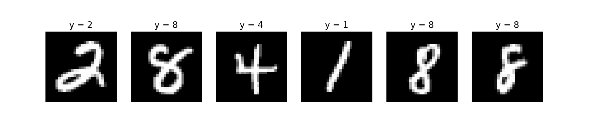
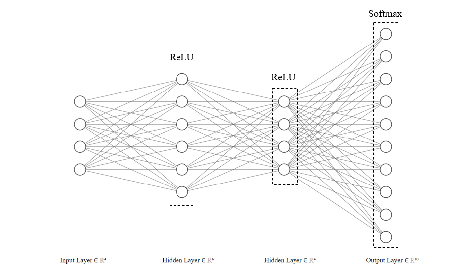

# MNIST Neural Network with NumPy

- [MNIST Database](#mnist-database)
- [Network Structure](#network-structure)
- [Activation Functions](#activation-functions)
- [Loss Function](#loss-function)
- [Back Propagation](#back-propagation)
- [He Initialisation](#he-initialisation)
- [Analysing Results](#analysing-results)

## Mnist Database
The MNIST database is a large database, containing 70,000 images of handwritten digits.

Each image is black and white, 28x28 pixels in size, and contains a singular handwritten digit.  

## Network Structure

This image is a simplified version of the networks architecture. It contains an input layer, hidden layers and an output layer. One important thing to note is that the output contains 10 different nodes. These correspond to the 10 digits (0-9) that the network is attempting to classify.

The ReLU functions in the hidden layers introduce non-linearity and a softmax function is applied to the output to convert the raw output (logits) to probabilities, which sum to 1.

In reality, the input layer contains 784 (28*28) input features and there are many more neurons in the hidden layers, however the general architecture is the same between the neural network in this image and the one in the code.

## Activation Functions

### ReLU

$$
ReLU(z) =
  \begin{cases}
    0 &\text{if } z \le 0 \\
    z &\text{if } z > 0 \\
  \end{cases}
$$

### Softmax

$$
Softmax(z_i) = \frac{e^{z_i}}{\sum_k e^{z_k}}
$$

## Loss Function

### Categorical Cross Entropy Loss

$$
L = -\sum_{i=1}^H y_i \cdot \log \hat{y}
$$

Where $H$ is the number of 'categories', $y$ the true label and $\hat{y}$ the predicted label.
## Back Propagation

### Deriving $\frac{\delta L}{\delta z_k}$

By the previously stated definition of Categorical Cross Entropy Loss

$$
L = -\sum_{i=1} y_i \log(o_i)
$$

where $o_i$ is the output of the softmax function, given by

$$
o_i = \frac{e^{z_i}}{\sum_{k=1} e^{z_k}}
$$

Now, using partial derivatives

$$
\begin{align*}
\frac{\delta L}{\delta z_k} &= \frac{\delta(-\sum_{i=1}y_i\log(o_i))}{\delta(z_k)}\\
&= -\sum_{i=1} \frac{\delta(y_i \log(o_i))}{\delta(z_k)}\\
&= -\sum_{i=1} y_i\cdot \frac{\delta(\log(o_i)}{\delta(z_k)}\hspace{10pt} \text{Since } y_i \text{ is independent of } z_k
\end{align*}
$$

By the chain rule we find that

$$
\frac{\delta{\log(o_i)}}{\delta{z_k}} = \frac{\delta(\log(o_i))}{\delta(o_i)}\cdot \frac{\delta(o_i)}{\delta(z_k)}
$$

Substituting this back in

$$
\frac{\delta L}{\delta z_k} = -\sum_{i=1} \left[ y_i \cdot \frac{\delta(\log(o_i))}{\delta(o_i)}\cdot \frac{\delta(o_i)}{\delta(z_k)}\right]
$$

Since $\frac{\delta(\log(o_i))}{\delta(o_i)} = \frac{1}{o_i}$

$$
\frac{\delta L}{\delta z_k} = -\sum_{i=1} \left[ \frac{y_i}{o_i} \cdot \frac{\delta(o_i)}{\delta(z_k)}\right]
$$

$\frac{\delta o_i}{\delta z_k}$ is the derivative of the Softmax output with respect to the input z_k which is given by

$$
\frac{\delta o_i}{\delta z_k} = 
\begin{cases}
    o_k(1-o_k) &\text{if } i = k \\
    -o_i \cdot o_k &\text{if } i \ne k \\
  \end{cases}
$$

In order to use this definition within our equation for $\frac{\delta L}{\delta z_k}$ we must re-write the sum

$$
\begin{align*}
\frac{\delta L}{\delta z_k} &= -\left[ \sum_{i\ne k}\left(\frac{y_i}{o_k}\cdot -o_i\cdot o_k \right) + \frac{y_k}{o_k}\cdot o_k(1-o_k)\right]\\
&= -\left[ \sum_{i\ne k}\left(-y_i\cdot o_k \right) + y_k(1-o_k)\right]\\
&= -\left[-o_k\sum_{i\ne k}\left(-y_i \right) + y_k(1-o_k)\right]
\end{align*}
$$

Since $y_i$ is one-hot encoded, we know that

$$
\sum_{i=1}y_i = 1 \hspace{10pt} \text{ and } \hspace{10pt} \sum_{i\ne k}y_i = 1 - y_k
$$

Therefore

$$
\begin{align*}
\frac{\delta L}{\delta z_k} &= -\left[-o_k(1-y_k) + y_k(1-o_k)\right]\\
&= -\left[-o_k + o_k\cdot y_k + y_k -o_k\cdot y_k)\right]\\
&= o_k - y_k
\end{align*}
$$

## He Initialisation

Weights cannot be initialised to 0. Since $a = \overline{w}X + b$ $\overline{w}=0$ would result in every neuron outputting 0 and all neurons outputting the same value, regardless of input (symmetry).

For this model, He initialisation is used and is defined as follows:

$$
W \sim N(0, \sqrt{\frac{2}{n_{in}}})
$$

This denotes a normal distribution with mean $0$ and standard deviation $\sqrt{\frac{2}{n_{in}}}$ where $n_{in}$ represents the number of input units to the layer.

Using He initialisation reduces the chances of gradients 'vanishing' or 'exploding' during backpropagation and also leads to faster convergence. It is particularly suited for neural networks utilising the ReLU activation function.
## Analysing Results

Analysing results
